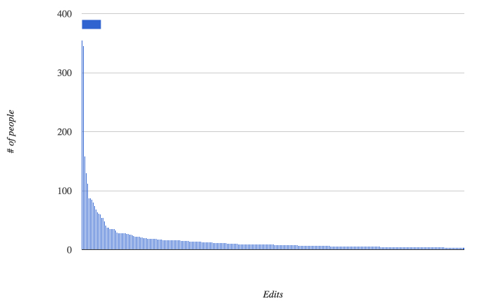
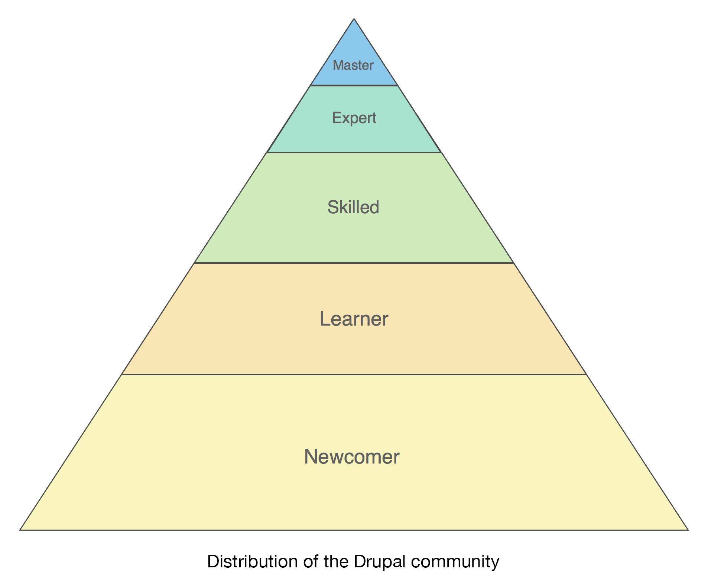

# Let's _Keep_  Talking About Documentation

_DrupalCon Barcelona - 2015_

Note: http://lb.cm/keep-talking-docs

----------

## Hello, My Name Is:

- Joe ([**@eojthebrave**](https://twitter.com/eojthebrave)) Shindelar

Note: Amber, Greg, and Joe all work for [Lullabot](https://www.lullabot.com). Joe is a member of the Drupal Documentation Working Group, while many of the things talked about in this presentation are also discussed by the DocsWG the opinions expressed here are Joe's opinions and not necessarily those of the DocsWG.

----------

## Follow Along

http://lb.cm/keep-talking-docs

----------

## What Are We Talking About?

- The current state of documentation
- Changes to Drupal.org that help support documentation
- The Drupal 8 user guide

----------

## What Is Documentation?

- [api.drupal.org](http://api.drupal.org)
- [Handbook](https://www.drupal.org/documentation)
- [Change records](https://www.drupal.org/list-changes)
- [Drupal 8 User Guide](https://www.drupal.org/project/user_guide)
- Books, blog posts, videos, etc.

Note: There are currently a few different "types" of documentation. API, Handbook, Change records.

----------

## The Awesome

- api.drupal.org
- Change records
- Drive by editing
- Getting better at recognizing contributions

Any changes we make should seek to preserve our existing strengths.

Note: Things that are currently working well, identified because any changes should seek to preserve these things as best as possible.

----------

<!-- .slide: data-background="../images/docs-contributors-cloud.jpg" data-background-size="80%" -->

Note: There are a lot of people contributing, which is exciting.

----------

## Thanks!

**Contributions since 2015-01-01**

- 6177 total edits
- 1147 contributors
- 629 (54%) with 2 or more edits
- 47 (20%) with 20 or more edits

----------

## It could be better

----------

Documentation is designed to help move Drupal.org users from [one skill level to the next](https://www.drupal.org/personas), by enabling them to successfully build, maintain, and improve Drupal sites and Drupal itself.

Note: Changes to d.o. and docs tools are generally made with Skilled > Expert in mind.

----------

## Pain Points

- Lack of curation, review, and oversight
- Organization and hierarchy when anyone can create a new page anywhere, it's chaos.
- Discoverability - people actually memorize URLs on d.o. to find what they are looking for!
- Versioning
- Translation
- Contributing to docs isn't as sexy as contributing code

----------

## Current Priorities

- D8 user facing documentation - [#d8docs](https://www.drupal.org/project/issues/search?status[]=Open&issue_tags=d8docs)
- Follow/Subscribe to pages and be notified when they change - [#2218551](https://www.drupal.org/node/2218551)
- Introduce concept of maintainers for documentation pages/sections - [#2332855](https://www.drupal.org/node/2332855)
- Better relationship between documentation pages, and issues that track the work that needs to be done on them.- [#995292](https://www.drupal.org/node/995292)
- [Drupal 8 User Guide](https://www.drupal.org/project/user_guide)
- Complete list of [DocsWG Goals](https://www.drupal.org/governance/docwg-goals)

----------

## Updating Drupal.org

- Create groups/sections of documentation
- Sections can have one or more maintainers
- Relate documentation to projects

----------

## More on Drupal.org Updates

- Session: [Content Strategy for Drupal.org](https://events.drupal.org/barcelona2015/sessions/content-strategy-drupalorg)
- [[META] Structure Drupal.org content around areas of user activity](https://www.drupal.org/node/2481515)
- [Content model for Drupal.org](https://www.drupal.org/node/2481519)

----------

## Lets Talk Documentation

[DrupalCon LA Session](https://events.drupal.org/losangeles2015/sessions/lets-talk-about-documentation)

- WordPress and MDN case studies
- Much discussion
- Drupal 8 User Guide

----------

## Curated Drupal Documentation

- Replace **key portions** of the Drupal.org Handbook with curated documentation
- Create **version dependent** documentation

Note: The idea of curated documentation has been [discussed previously](https://www.drupal.org/node/1291058). There was a [plan for how to make a system for curated documentation](https://www.drupal.org/node/1095012). There was also a [plan to put the Developer docs into the Drupal Core repository](https://www.drupal.org/node/2106873) using Asciidoc. The [Configurable Help Module](https://www.drupal.org/sandbox/jhodgdon/2369943), which is currently a Drupal 8 sandbox, allows a module to define one or more help topics as configuration. These topics are imported when the module is enabled, and then can be managed, edited, and viewed within a Drupal site. Topics marked as “top-level” are listed on the admin/help page, and topics can be cross-referenced.

----------

## Drupal 8 User Guide

https://www.drupal.org/project/user_guide

- Written in AsciiDoc
- Version control with Git
- Reviews, and updates in the issue queue

----------

## Thanks!

jodgdon, batigolix, michaellenahan, Sree, bemery987, lesmana, eojthebrave, HaloFX, surendramohan, ajayvi, eelkeblok, generalludd, gortonstudios, ifrik, jfmacdonald, karlkedrovsky

----------

## So where are we now?

- Making progress on an initial writing phase

----------

<!-- .slide: data-background="../images/user-manual-tracking-sheet.jpg" -->

----------

## So where are we now?

- Making progress on an initial writing phase
- AsciiDoc, and HTML compilation
- Guidelines, and templates, are solid
- About 40% of the initial pass is claimed

----------

<!-- .slide: data-background="../images/user-guide-screenshot.jpg" -->

----------

## Finishing the guide

- Anyone can help
- Sprints, user groups, etc.
- Getting the content on Drupal.org

----------

## Sprints - Friday

- General documentation
- User Guide
- Content Audit

----------

# The End!

Joe **[@eojthebrave](https://twitter.com/eojthebrave)** Shindelar
 
 
 
 
Feedback: https://events.drupal.org/barcelona2015/sessions/let's-keep-talking-about-documentation
